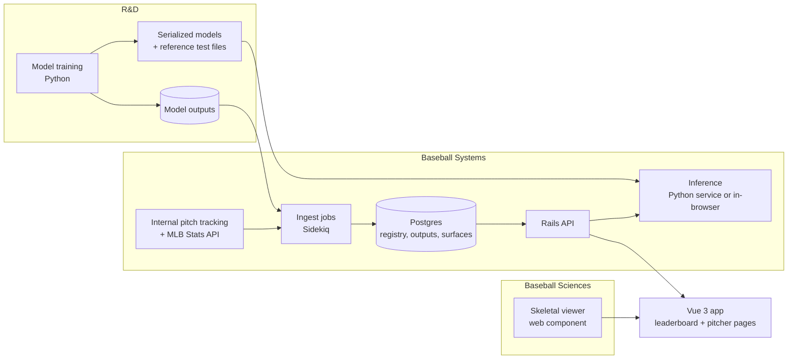

# PRD: Pitcher Pages (Stuff, Location, Pitching models)

| | |
|---|---|
| **Owner** | Baseball Product Engineering (BPE) |
| **Partners** | R&D (model authors), Baseball Systems (platform and data), Baseball Sciences (biomechanics) |
| **Users** | GM and front office, Director of Pitching and pitching coaches, pro scouting, R&D, baseball ops |
| **Status** | Ready for review. A working prototype on public data is live. |
| **Prototype** | https://alowenthal10.github.io/wsh-pitching-problem-set/ · code in this repo |

---

## 1. Summary

The club has three pitch models: **Stuff** (physical traits of a pitch), **Location** (value of where it was thrown, given count and batter side), and **Pitching** (the two combined). Their outputs live in tables and notebooks. This product puts them in front of decision-makers as:

- a **leaderboard** of every qualified pitcher in the league, filterable by team, role, and season, and
- a **pitcher page** for each pitcher that leads with a verdict and backs it with evidence.

Each audience gets a direct answer:

- **Front office:** How good is he? How sure are we? Do his results agree?
- **Pitching staff:** Which pitch is the lever, and what shape change would help it?
- **R&D:** A place to ship new model outputs without new front-end work.

The prototype runs the whole design end to end on public data: Statcast, the open-source tjStuff+ model, this project's own Location and Pitching models, and the MLB Stats API. Production replaces the public data and models with the club's internal versions and runs on Rails and Vue (§6). The page design, data contracts, and validation approach carry over unchanged.

## 2. What the prototype proved

The prototype was built to test the riskiest assumptions before Systems commits engineering time. Results from the 2025 and 2026 seasons (about 706k and 710k pitches, about 770 qualified pitchers per season):

| Question | Result | Consequence for this PRD |
|---|---|---|
| Can a Stuff model be served faithfully outside its notebook? | The pipeline reproduces Nestico's published 2024 tjStuff+ at **r = 0.999**, mean difference **0.08 points** (562 pitchers). The browser implementation matches Python to 0.0001. | Pitch Lab can run the real model. The R&D → Systems handoff (§7.2) requires a reference test file. |
| Are model grades better than results for decisions? | Split-half test (fit on odd days, test on even): Pitching predicts second-half run value at **r = 0.26–0.29**. First-half *results* predict at **0.13–0.23**. Stuff is stable across halves at r = 0.97. | Supports the GM's model-first layout. Results stay on the page as context, not as the headline. |
| Should the Pitching model weight Location fully? | **No.** Location is a stable skill (r = 0.63–0.70 across halves) but barely predicts future run value on its own (r = 0.02). A full-weight blend predicted *worse* than Stuff alone. Choosing Location's weight out of sample (30–40% of the fitted value) fixed it. | **Requirement M-3:** every blended model's weights are chosen out of sample, and R&D's model card reports split-half results (§7.2). |
| Can heatmaps be smooth without hiding signal? | Yes. The smoothing width is chosen by out-of-sample fit: 0.3 ft won in both seasons, ahead of 0.2, 0.4, and 0.5 ft. | The R&D analyst's concern is resolved at the source. Surfaces are model output, not binned averages. |
| Can grip and seam effects be estimated from public data? | Partly. Seam-shifted wake (measured spin axis vs. actual movement) is clean on sinkers (+28°), changeups (+23°), and splitters (+28°). Four-seamers center at 0° once calibrated per throwing hand. It is not meaningful on cutters and sliders. | Seam presets apply to sinkers, changeups, and splitters only. A true grip → movement model is still a Phase 3 dependency. |
| Can the site build itself? | A GitHub Action rebuilds everything daily: about 6 minutes on first run, 2–3 minutes from cached data. It produces 979 pitcher pages across both seasons, with Stats API innings and ERA for every pitcher. | The production ingest design (§6) is proven at league scale. |

Only one element of the prototype is still a placeholder: the formula that credits a persistent results gap in the results-adjusted grade (R-3). That is a modeling judgment R&D should own.

## 3. Goals and non-goals

### Goals
1. Every model output on the **20–80 scale**, with its sample-size reliability. Raw values on hover. No percentiles.
2. A **written bottom line** at the top of each pitcher page, generated from the data.
3. **Results context** next to grades, so habitual over- and under-performers aren't misread.
4. A **what-if tool** (Pitch Lab) that runs the production Stuff model.
5. **Smooth Location surfaces** instead of noisy binned heatmaps.
6. A **mount point for the Baseball Sciences skeletal viewer**.
7. A **model registry**, so future models ship as data plus configuration.
8. A **league leaderboard and search**, so any pitcher is two clicks away.

### Non-goals (v1)
- Percentiles. The GM prefers grades. The API keeps raw values, so a toggle can come later.
- Hitters, team pages, and live in-game views.
- Training or changing R&D's models. BPE displays them and holds them to the validation contract in §7.2.
- A grip/seam → movement model. Pitch Lab is built to accept one (§5.4).

## 4. Stakeholder feedback and decisions

| Feedback | Decision | Phase | Rationale |
|---|---|---|---|
| GM: be opinionated; the most important information gets the most visual weight | **Adopt** | 1 | Pitcher pages open with the Pitching grade, a role label, and a 3–4 item bottom line. The leaderboard sorts by Pitching grade. |
| GM: 20–80 grades, not percentiles | **Adopt** | 1 | One conversion, owned by Rails (§6.3). Grades show in 5-point steps. |
| Director of Pitching: how Stuff changes with movement | **Adopt** | 2 | The Stuff model already takes velocity and movement as inputs, so this is inference, not new modeling. Built in the prototype. |
| Director of Pitching: grips and seam orientation | **Adopt in two steps** | 2 → 3 | v1 presets come from league data: the shape of top-quarter pitches of that type from similar arm angles, and the league's top-quarter seam effect. A real grip → movement model is Phase 3. |
| R&D: location heatmaps will look splotchy | **Fix at the source** | 1 | Draw the model's surface on a 0.1 ft grid, smoothed with a width chosen out of sample. Never average raw outcomes. |
| Baseball Sciences: skeletal viewer with pitch comparison | **Embed** | 3 (slot in 1) | BPE provides the slot and a release-metrics table. Baseball Sciences ships a web component (§6.6). The prototype shows a real motion-captured reference delivery in the meantime. |
| "Like Baseball Savant, but better" | **Interpret** | 1–2 | Savant describes; this recommends. That means grades instead of percentiles, a written verdict, count-split heatmaps, reliability on every number, and one pitch selection that drives the page. |
| Don't lose context on over- and under-performers | **Adopt** | 2 | "Results vs. model" shows multi-season expected vs. actual ERA, a persistent-gap flag, and graded traits the models don't capture. |
| Extensible to unknown future models | **Adopt** | 1 | Registry plus long-format outputs (§6.2). A new model needs a registry row, data, and one line of slot config. |
| *(Added)* Baseball ops: transaction history | **Adopt** | 1 | Injury history changes how a grade drop reads and whether a pitch change is safe to try. |
| *(Added)* League leaderboard, search, shareable pitcher URLs | **Adopt** | 1 | Makes the product a destination, not a one-pitcher view. The Nationals are highlighted. |

## 5. Requirements

Priority: **P0** launch-blocking, **P1** launch if possible, **P2** later. The **Prototype** column shows what the public prototype already demonstrates.

### 5.1 Leaderboard and navigation
| ID | Requirement | Priority | Prototype |
|---|---|---|---|
| N-1 | League leaderboard: every qualified pitcher with Pitching, Stuff, and Location grades, pitches, IP, ERA, model-expected ERA, and best pitch. Sortable. | P0 | Built |
| N-2 | Filters: team, role (starter/reliever), minimum pitches, season. Filters persist in the URL so views can be shared. | P0 | Built |
| N-3 | State the qualification rule on the page. Default view uses a minimum sample so short-sample relievers don't top the list. | P0 | Built (50+ pitches to appear; 300+ by default) |
| N-4 | Highlight the club's own pitchers. Show team logos (spots). | P1 | Built |
| N-5 | Search from every page, accent-insensitive, keyboard-navigable. | P0 | Built |
| N-6 | Stable, readable pitcher URLs (`/pitchers/mackenzie-gore`). Duplicate names are disambiguated by ID. | P0 | Built (static pages per pitcher) |
| N-7 | Breadcrumb from the pitcher page back to the team-filtered leaderboard. | P1 | Built |

### 5.2 Pitcher summary
| ID | Requirement | Priority | Prototype |
|---|---|---|---|
| S-1 | Pitching, Stuff, and Location grades. Pitching is the largest element on the page. | P0 | Built |
| S-2 | Each grade shows its raw value and an uncertainty band based on pitches thrown vs. the model's stabilization point. | P0 | Built |
| S-3 | Role label from the Pitching grade (e.g. 55 = No. 3 starter). Front office owns the thresholds. | P1 | Built |
| S-4 | 3–4 item bottom line generated by reviewable rules. Each item links to its evidence. | P0 | Built |
| S-5 | Monthly grade trends. | P1 | Built |
| S-6 | Season results (ERA, FIP, IP, K%, BB%, HR/9). | P0 | Built |

*Acceptance:* at 1280×800, a GM can state the pitcher's grade, role, and main concern without scrolling.

### 5.3 Arsenal and locations
| ID | Requirement | Priority | Prototype |
|---|---|---|---|
| A-1 | Per pitch type: usage, all three grades, velocity, IVB, HB, spin, whiff%, xwOBA. | P0 | Built |
| A-2 | "Not yet stable" styling for grades below the model's stabilization sample. | P0 | Built |
| A-3 | Movement plot (size = usage, fill = Stuff grade). One selected pitch drives the whole page. | P0 | Built |
| L-1 | Location surfaces for the selected pitch and batter side, as three small multiples: Ahead, Even, Behind. | P0 | Built |
| L-2 | Surfaces are model output on a ≤ 0.1 ft grid, banded in 5-grade steps. Smoothing is chosen out of sample. | P0 | Built (0.3 ft chosen) |
| L-3 | Overlay where he actually throws the pitch (50% and 80% contours), split by batter side. | P0 | Built |
| L-4 | A written read of the gap between the most valuable spot and his actual location. | P1 | Built |

### 5.4 Pitch Lab
| ID | Requirement | Priority | Prototype |
|---|---|---|---|
| P-1 | Sliders for velocity, IVB, and HB. Show the projected Stuff grade, the change, and the effect on the overall grade. | P0 | Built |
| P-2 | Projections use the **production Stuff model** on a sample of his actual pitches, holding everything else at his actuals. Changing the primary fastball re-scores every pitch measured against it. | P0 | Built (tjStuff+ in the browser) |
| P-3 | Stuff grade surface over IVB × HB, with his actual pitch-to-pitch spread overlaid. | P1 | Built |
| P-4 | Warn when a projection is more than 3 SD from anything he threw. | P1 | Built |
| P-5 | Data-based presets: the shape of top-quarter pitches of the same type from similar arm angles, and top-quarter seam effect (sinkers, changeups, splitters only). | P1 | Built |
| P-6 | Projection intervals. R&D supplies the method. | P1 | Not built |
| P-7 | Grip → movement model behind the presets. | P2 | Not built (Phase 3) |
| P-8 | Save and share a scenario with a note. | P2 | Not built |

*Acceptance:* projection in under 300 ms (p95), matching R&D's reference file within 0.1 Stuff+. The prototype takes about 170 ms and matches to 0.0001.

### 5.5 Results vs. model
| ID | Requirement | Priority | Prototype |
|---|---|---|---|
| R-1 | Per season: IP, Pitching grade, model-expected ERA, ERA, FIP, and the gap, with a chart. | P0 | Built (league ERA + 9 × model runs above average ÷ IP) |
| R-2 | Flag a persistent over- or under-performer. R&D sets the thresholds. | P0 | Built (placeholder thresholds) |
| R-3 | Results-adjusted grade that credits part of a persistent gap. **R&D owns the formula.** | P1 | Placeholder, labeled on the page |
| R-4 | Graded traits the pitch models don't capture: perceived velocity, fastball approach angle vs. expected, release-point consistency, times-through-the-order penalty, arm-angle tell risk. Each is a future registry slot. | P1 | Built |

### 5.6 Availability and transactions
| ID | Requirement | Priority | Prototype |
|---|---|---|---|
| T-1 | Filterable transaction log: injury, trade, signing/claim, roster move. | P0 | Built |
| T-2 | IL stints and days missed over 3 seasons. A 15→60-day transfer counts as one stint. | P0 | Built |
| T-3 | Flag an open IL stint. | P0 | Built |
| T-4 | Options remaining and service time from the club's roster system. The public feed can only count seasons with an option. | P1 | Not built (needs internal data) |
| T-5 | Shade IL stints on the grade trend. | P2 | Not built |

*Acceptance:* IL day counts match internal injury records for five named pitchers.

### 5.7 Biomechanics
| ID | Requirement | Priority | Prototype |
|---|---|---|---|
| B-1 | Mount the Baseball Sciences viewer with two pitch IDs and a delivery phase (§6.6). | P0 (Phase 3) | Slot built. A real reference delivery (Driveline OpenBiomechanics) is matched on hand and arm angle and labeled as not his own motion. |
| B-2 | Release comparison table (arm angle, release height and side, extension) with tell thresholds. | P1 | Built from his Statcast data |
| B-3 | Shared state between viewer and page (pitch, phase). | P1 | Built for the stand-in |

### 5.8 Models and platform
| ID | Requirement | Priority | Prototype |
|---|---|---|---|
| M-1 | Model registry drives every model display. Each value shows its model version. | P0 | Built |
| M-2 | Model card per model: inputs, scale, grade spread, stabilization sample, known blind spots. | P0 | Built for all three models |
| M-3 | **Blended models choose their weights out of sample**, and each model card reports split-half stability and predictive power. | P0 | Built |
| M-4 | Every element not backed by real data or a real model is tagged on the page. | P0 | Built |
| X-1 | Leaderboard and pitcher page load under 1.5 s (p95). | P0 | Met on static hosting |
| X-2 | Role-based access: Pitch Lab and biomechanics follow existing player-development permissions. | P0 | Not applicable (public prototype) |
| X-3 | Responsive to 400 px. Light and dark themes. | P1 | Built |

## 6. Technical design (for Baseball Systems)

### 6.1 Production architecture



- **Rails** is the system of record and the only API the browser calls. It assembles page payloads, converts values to grades, serves the leaderboard and search, and routes `/pitchers/:slug`.
- **Pitch Lab inference: decide in Phase 0.** The prototype shows a third option beyond a Python service or ONNX-in-Rails. Tree models can be exported to about 1 MB of JSON and run in the browser: no service to operate, about 170 ms per projection, and verified identical to Python. The trade-off is that the model is visible to anyone with page access. That is fine behind club auth, but a decision for R&D.
- **Vue 3 + Pinia + Vite** inside the existing Vue app. Vue Router in history mode, so `/pitchers/:slug` needs no static-page workaround.

### 6.2 What carries over from the prototype

| Prototype piece | Production equivalent | Carries over? |
|---|---|---|
| `pipeline/build_stuff.py`: Savant download, feature mapping, scoring | Ingest jobs on internal pitch tables | **Logic yes, source no.** Feature mapping and scaling are the reference implementation. |
| `pipeline/location_model.py`: surfaces, blend, split-half | R&D's Location and Pitching models | **Method as a benchmark.** R&D's models must meet or beat the split-half numbers in §2. |
| `pipeline/traits.py`, `pipeline/leaders.py` | Rails jobs writing `model_outputs` rows | Yes, as registry entries |
| Per-pitcher JSON payload | `GET /api/v1/pitchers/:id/page` response | **Yes.** The shape is the API contract. |
| `mockup/assets/*.js` (Vue, single files) | Vue components (§6.5) | Yes, split into components |
| Static pages per pitcher | Rails route + Vue Router | No (static hosting workaround) |
| GitHub Actions daily build | Sidekiq schedule | No |

### 6.3 Data model

**`model_definitions`** (the registry): `key`, `version`, `display_name`, `scale_type` (`plus` / `run_value` / `probability` / `grade`), `higher_is_better`, `stabilization_n`, `status` (`live` / `beta` / `planned` / `retired`), `owner`, `model_card_url`, and the grade spread per level and pitch type (below).

**`model_outputs`** (long format, partitioned by season): `model_definition_id`, `entity_type` (`pitch` / `pitcher_pitch_type` / `pitcher`), `entity_id`, `season`, `split_key` (`all`, `vs_L`, `count:ahead`, `month:2026-05`), `pitch_type`, `value`, `n`, `computed_at`. Unique on everything but `value`, `n`, and `computed_at`.

**`model_surfaces`**: `model_definition_id`, `surface_key` (e.g. `FF:ahead:same`), grid bounds and step, row-major values. The prototype confirms the Location surface doesn't depend on the pitcher. Surfaces are computed once per model version: up to 9 pitch types × 3 count states × 2 sides × a 41 × 51 grid, about 110k small integers, served as one cacheable file.

**`pitcher_seasons`** (leaderboard): one row per pitcher-season with team, role, IP, ERA, expected ERA, the three grades, best pitch, and slug.

**Page slots**: a versioned YAML file mapping registry keys to page slots. Adding a model = registry row + outputs + one slot line.

### 6.4 Grade conversion

Done once in Rails and returned with the raw value. The front end never does scale math.

```
plus  = 100 − 10 × z(model value), with z computed across the season's pitches   (lower run value = better)
grade = clamp(50 + 10 × (plus − mean_type) / spread_type, 20, 80);  display = round(grade / 5) × 5
spread_type = (99.9th − 0.1th percentile of pitcher-level plus for that pitch type) / 6
```

This is tjStuff+'s method, applied identically to all three models in the prototype. It means a 60 changeup and a 60 fastball are equally rare among changeups and fastballs. **Proposed default; R&D to confirm or replace (§10).**

### 6.5 API (Rails, JSON)

| Method | Path | Returns |
|---|---|---|
| GET | `/api/v1/leaders?season=&team=&role=&min_pitches=&sort=` | Leaderboard rows (`pitcher_seasons`) |
| GET | `/api/v1/pitchers/search?q=` | Name matches with slug, team, and seasons |
| GET | `/api/v1/pitchers/:slug/page?season=` | Everything one pitcher page needs, in one request (shape = prototype JSON) |
| GET | `/api/v1/models` | Registry, for the footer and for slots |
| GET | `/api/v1/surfaces/:model_key?season=` | All Location surfaces for a model version (long-lived cache) |
| POST | `/api/v1/pitch_lab/predict` | Only if inference runs server-side: `{pitcher_id, pitch_type, deltas}` → `{plus, grade, interval, model_version}` |
| GET | `/api/v1/pitchers/:id/biomech/compare?a=&b=` | Release metrics for two pitch IDs, proxied from Baseball Sciences |

The bottom line is generated server-side by a small, tested rules module that front office staff can review.

### 6.6 Front-end components and the viewer contract

`LeadersPage` (`LeaderTable`, `TeamSpot`, `Filters`) and `PitcherPage` (`SummaryBand`, `ArsenalTable`, `MovementPlot`, `PitchLab`, `LocationSurfaces`, `ResultsVsModel`, `TransactionLog`, `BiomechSlot`, `ModelFooter`), plus shared `SiteSearch`, `GradeChip`, and `ReliabilityBadge`. A Pinia store holds the pitcher, season, selected pitch, and batter side.

Baseball Sciences ships its viewer as a custom element so it mounts without coupling to our build:

```html
<bsci-skeleton-viewer pitch-a="…" pitch-b="…" phase="release" view="catcher"></bsci-skeleton-viewer>
```

Props: two pitch IDs, `phase` (`leg_lift` / `foot_strike` / `max_er` / `release` / `follow_through` or 0–1), and `view` (`side` / `catcher`). The prototype found the catcher view is where arm-slot tells show. Events: `phase-change`, `ready`, `error`. It authenticates with the page session.

### 6.7 Data sources and licensing

| Source | Prototype use | Production |
|---|---|---|
| Statcast (Baseball Savant) | All pitch data, about 710k pitches per season | Internal pitch tracking tables |
| MLB Stats API | Bio, rosters, transactions, IP/ERA, headshots, team spots | Same data, pulled server-side on a schedule and cached |
| tjStuff+ (Nestico, MIT) | Stuff model | R&D's internal Stuff model |
| Driveline OpenBiomechanics (CC BY-NC-SA 4.0) | Reference delivery | Baseball Sciences' own data |

The public data is licensed for non-commercial use only (MLBAM terms; CC BY-NC-SA). That is fine for the prototype. Production must use the club's own data and models.

## 7. Handoffs and responsibilities

### 7.1 Who owns what

| Work | R&D | BPE | Baseball Systems | Baseball Sciences |
|---|---|---|---|---|
| Models: method, training, validation | **Owns** | Consulted | — | Consulted (biomech features) |
| Model card and validation report (M-2, M-3) | **Owns** | Reviews | Informed | — |
| Results-adjusted grade formula (R-3) | **Owns** | Displays | — | — |
| Output contract (§6.3) and API (§6.5) | Delivers to it | **Owns spec** | Approves, implements | — |
| Ingest, storage, scheduling, monitoring | Informed | Consulted | **Owns** | — |
| Pitch Lab inference | Delivers model + reference file | Defines contract | **Owns runtime** | — |
| Grades, rules engine, page payload | Validates numbers | **Owns** | Reviews, deploys | — |
| Vue components and UX | Reviews | **Owns** | Reviews | — |
| Skeletal viewer | — | Contract and slot | Hosting and auth | **Owns** |
| Grip → movement model (Phase 3) | Co-owns | Consumes | Serves | Co-owns |
| Release | Signs off on numbers | Signs off on UX | **Owns** | Signs off on viewer |

### 7.2 Handoff artifacts

Each handoff is a concrete artifact with a "done" test.

1. **R&D → BPE: model card and validation report** (Phase 0, per model)
   - Inputs, output scale, grade spread by pitch type, stabilization sample, known blind spots, version.
   - **Split-half report in the prototype's format:** stability across halves and second-half predictive power, next to the prototype's numbers in §2.
   - *Done when* the report is in the registry, and each model matches or beats the public baseline, or the gap is explained.
2. **R&D → Systems: model artifact and reference file** (Phase 0 for Stuff)
   - Serialized model, feature builder, pinned dependencies, and 1,000 inputs with expected outputs.
   - *Done when* production inference reproduces the file within 0.1 Stuff+ (the prototype achieved 0.0001).
3. **BPE → Systems: spec package** (end of Phase 0)
   - This PRD, OpenAPI for §6.5, draft migrations for §6.3, and the prototype's JSON payloads as fixtures.
   - *Done when* Systems has estimated the work and confirmed the schema fits existing pipelines.
4. **Systems → BPE: staging API** (each phase)
   - *Done when* the Vue app runs against staging with no fixtures.
5. **Baseball Sciences → BPE: viewer component** (Phase 3)
   - *Done when* it mounts in the slot and follows pitch and phase changes.
6. **New model onboarding** (ongoing)
   - Model card + validation report + outputs → registry row + one slot line.
   - *Done when* the model renders with no new front-end component. Target: one week.

### 7.3 Rituals
- Weekly 30-minute BPE / Systems / R&D sync. Baseball Sciences joins biweekly in Phase 3.
- A numbers check before each release: R&D reviews five named pitchers against their notebook.
- A feedback button on every page that files to BPE's queue, tagged by section.

## 8. Roadmap

The prototype pulls forward most of the design and validation work, so Phase 0 is about contracts and internal data, not discovery.

| Phase | Length | Scope | Exit criteria |
|---|---|---|---|
| **0. Contracts** | 2 weeks | Model cards and split-half reports for internal models; grade-spread decision; inference decision; OpenAPI and migrations; prototype reviewed with the GM and Director of Pitching | Signed-off spec package. Internal models meet the §2 baseline. |
| **1. MVP** | 5 weeks | Registry, ingest, leaderboard, search, pitcher summary, arsenal, Location surfaces, transactions, models footer | Live for front office behind club auth. Numbers check passed. |
| **2. Decisions** | 5 weeks | Pitch Lab on the internal Stuff model, Results vs. model with R&D's formula, traits panel, options and service time | Pitching staff use Pitch Lab in at least 3 bullpen planning sessions. |
| **3. Integration** | 6–8 weeks, partner-dependent | Baseball Sciences viewer, grip → movement model behind presets, saved scenarios, pitch video | Viewer embedded. Grip model in beta. |

## 9. Success metrics
- **Adoption:** 80% of intended front office and pitching staff users are active monthly by the end of Phase 2.
- **Decision use:** cited in trade, waiver, and development meetings (monthly survey).
- **Model quality:** each production model meets or beats the §2 split-half baseline, re-checked every season.
- **Speed:** new model outputs visible on the page within one week.
- **Trust:** zero open number-mismatch bugs at each release.
- **Performance:** pages p95 under 1.5 s; Pitch Lab p95 under 300 ms.

## 10. Risks and open questions

| Risk or question | Mitigation, owner, or proposed answer |
|---|---|
| Grades hide uncertainty (a 60 on 150 pitches looks like a 60 on 2,500) | Reliability bands, "not yet stable" styling, and a default leaderboard minimum are all P0 and built. |
| A blended model over-weights a stable-but-unpredictive input (seen with Location) | M-3: weights chosen out of sample, with split-half reports in every model card. |
| Pitch Lab projections outside his own range look precise | 3-SD warning (built). R&D supplies intervals (P-6). |
| Presets imply changes a pitcher can't make | Presets are league references from similar arm angles, labeled as hypotheses for the pitching staff. A grip model replaces them in Phase 3. |
| Seam-effect estimates are wrong on gyro pitches | Seam presets limited to sinkers, changeups, and splitters. Calibration is per throwing hand. |
| The results-adjusted grade is read as replacing the model | Labeled as secondary, with the formula shown. R&D owns it. |
| What spread defines a grade step? | **Proposed:** the per-pitch-type percentile spread (§6.4), used for all three models in the prototype. R&D to confirm, Phase 0. |
| Which estimator anchors model-expected ERA? | **Proposed:** league ERA + 9 × Pitching-model runs above average ÷ IP. R&D to confirm or replace, Phase 0. |
| Is the Location model pitcher-agnostic? | **Confirmed for the prototype's model.** The surface caching plan holds. R&D to confirm for the internal model. |
| Pitch Lab inference: browser or service? | **Open**, R&D and Systems, Phase 0 (§6.1). |
| Is biomech data captured for every pitch or only sampled sessions? | **Open**, Baseball Sciences, Phase 0. |
| Public-data licenses are non-commercial | Production uses internal data and models only (§6.7). |
