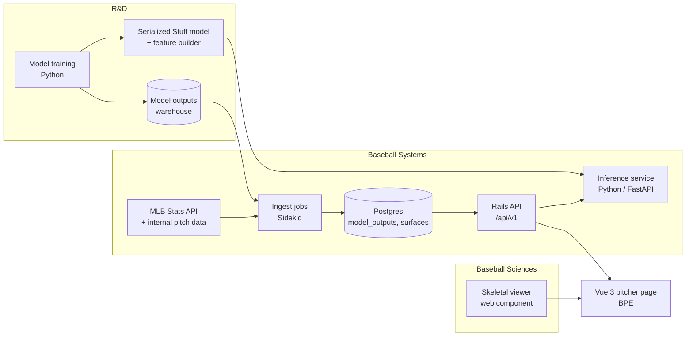

# PRD: Pitcher Page (Stuff, Location, Pitching models)

| | |
|---|---|
| **Owner** | Baseball Product Engineering (BPE) |
| **Partners** | R&D (model author), Baseball Systems (platform and data), Baseball Sciences (biomechanics) |
| **Primary users** | GM and front office, Director of Pitching and pitching coaches, R&D, pro scouting |
| **Status** | Draft for review |
| **Mockup** | [`mockup/index.html`](../mockup/index.html) |

---

## 1. Summary

We have three internal pitch models: **Stuff** (physical traits of a pitch), **Location** (value of where it was thrown, by count and batter side), and **Pitching** (both together, plus context). Today their outputs live in tables and notebooks. This project builds one pitcher page that turns those outputs into decisions:

- **Front office:** how good is this pitcher, and how sure are we?
- **Pitching staff:** which pitch should change, and how?
- **R&D:** a place to ship new model outputs without new front-end work each time.

The page is opinionated. The decision-driving number (the Pitching grade on the 20–80 scale) gets the most visual weight. Supporting evidence follows in order of decision value.

## 2. Goals and non-goals

### Goals
1. Show every model output on the **20–80 scouting scale** with its sample-size reliability. The raw "plus" value stays available on hover.
2. Put a **written bottom line** at the top of the page, generated from the data, so a reader gets the answer before the evidence.
3. Keep **results context** next to model grades so habitual over- and under-performers are not misread.
4. Give the pitching staff a **what-if tool** (Pitch Lab) built on the production Stuff model.
5. Render Location model output as **clean, smooth surfaces**, not noisy binned averages.
6. Provide a **mount point for the Baseball Sciences skeletal viewer** with pitch-to-pitch comparison.
7. Build on a **model registry** so future models ship as data plus configuration.

### Non-goals (v1)
- Percentile displays. The GM prefers grades. The API still returns raw values, so percentiles can be added later as a toggle.
- Hitter pages, team pages, and live in-game views.
- Training or changing the models. R&D owns model methodology.
- The seam-orientation-to-movement model. Pitch Lab is designed to accept it, but building it belongs to Baseball Sciences and R&D (see §5.4).
- Mobile-first design. The page must work on a phone, but it is designed for desktop and tablet.

## 3. Stakeholder feedback and decisions

| Feedback | Decision | Phase | Rationale |
|---|---|---|---|
| GM: be opinionated; most important info gets the most visual weight | **Adopt** | 1 | The page opens with the Pitching grade, role label, and a 3–4 item bottom line. Everything else is evidence. |
| GM: 20–80 grades over percentiles | **Adopt** | 1 | One server-side conversion: grade = 50 + 10 × (plus − 100) / SD. SDs are set per model and per level (pitch or pitcher) by R&D. Grades show in 5-point steps. |
| Director of Pitching: how Stuff changes with movement | **Adopt** | 2 | The Stuff model already takes velocity and movement as inputs, so a what-if is model inference with no new modeling. |
| Director of Pitching: how Stuff changes with grips and seam orientation | **Scope down** | 3 | The Stuff model does not take grip or seam orientation. That needs a separate seam-to-movement model. v1 ships the preset UI with hand-entered deltas, clearly labeled. The real model is a Phase 3 dependency. |
| R&D: location heatmaps will be splotchy | **Adopt, and fix at the source** | 1 | Splotchiness comes from averaging noisy pitch outcomes into bins. We evaluate the Location model on a dense grid instead, then band it into 5-grade steps. No outcomes are averaged, so there is no noise to smooth. The pitcher's actual tendencies are overlaid as density contours. |
| Baseball Sciences: integrate skeletal viewer with pitch comparison | **Adopt as embed** | 3 (slot in 1) | BPE provides the slot, pitch selection, and a release-metrics comparison table. Baseball Sciences ships the viewer as a web component (§6.6). We do not rebuild their viewer. |
| "Like Baseball Savant, but better" | **Interpret** | 1–2 | Savant describes. This page recommends. Concretely: grades instead of percentiles, a written bottom line, small-multiple heatmaps by count, reliability on every number, and one pitch selection that drives the whole page. |
| Losing context on habitual over/under-performers | **Adopt** | 2 | A "Results vs. model" section shows multi-season expected vs. actual ERA, a results-adjusted grade (credibility-weighted), and candidate traits the models don't capture. |
| (Added) Baseball ops: player transaction log | **Adopt** | 1 | Injury history changes how a grade change reads and whether a pitch change is safe to try. Roster moves (options, recalls, DFAs) are daily ops work. It is also fully real data, from the MLB Stats API `transactions` hydration. |
| Extensible to unknown future models | **Adopt** | 1 | Model registry, long-format outputs table, and a generic grade component (§6.2). Proof point: a new model ships with no new Vue components. |

## 4. Users and key questions

| User | Question the page must answer in under 30 seconds |
|---|---|
| GM / front office | How good is he, how sure are we, and is there a reason to trust results over the model (or the reverse)? |
| Director of Pitching / coaches | Which pitch is the lever, what shape change helps it, and is that change realistic for his arm? |
| Pro scouting | Does the model agree with what I see? Where does he miss? |
| R&D analyst | Is my model displayed correctly, with the right version, scale, and reliability? |
| Baseball Sciences | Does a pitch's delivery differ from his fastball in a way hitters could read? |

## 5. Requirements

Priority: **P0** = required for launch, **P1** = launch if possible, **P2** = later.

### 5.1 Summary band
| ID | Requirement | Priority |
|---|---|---|
| S-1 | Show Pitching, Stuff, and Location grades for the selected pitcher and season. Pitching is the largest element on the page. | P0 |
| S-2 | Each grade shows its raw plus value and an uncertainty band (± grade) based on pitches thrown vs. the model's stabilization point. | P0 |
| S-3 | Show a role label derived from the Pitching grade (e.g. 55 = No. 3 starter). Thresholds are configurable and owned by the front office. | P1 |
| S-4 | Show a 3–4 item bottom line generated from rules over the data (best pitches, weakest lever, command gap, results gap). Each item links to its evidence section. | P0 |
| S-5 | Show monthly grade trends for the season. | P1 |
| S-6 | Show traditional season results (ERA, FIP, IP, K%, BB%, HR/9). | P0 |

*Acceptance:* a GM can state the pitcher's grade, role, and main concern from the top of the page with no scrolling at 1280×800.

### 5.2 Arsenal
| ID | Requirement | Priority |
|---|---|---|
| A-1 | Table of pitch types with usage, Pitching/Stuff/Location grades, velocity, IVB, HB, spin, whiff%, and xwOBA. | P0 |
| A-2 | Grades below the model's stabilization threshold get a distinct "not yet stable" treatment (dashed outline) and a tooltip with n. | P0 |
| A-3 | Movement plot with marker size = usage and fill = Stuff grade. | P0 |
| A-4 | Selecting a pitch (table row or plot) sets the page-wide selected pitch. | P0 |
| A-5 | Split by batter side and by count. | P1 |

### 5.3 Locations
| ID | Requirement | Priority |
|---|---|---|
| L-1 | For the selected pitch and batter side, show three small-multiple surfaces: Ahead, Even, Behind. | P0 |
| L-2 | Surfaces are the Location model evaluated on a grid of 0.1 ft or finer, banded into 5-grade steps on a diverging 20–80 color scale. | P0 |
| L-3 | Overlay the pitcher's actual location density as 50% and 80% contours. | P0 |
| L-4 | Toggle to a "raw binned" view for analysts who want to check the data. | P2 |
| L-5 | Strike zone, plate, and batter side always visible. Catcher's view. | P0 |
| L-6 | A one-sentence written read of the gap between where the pitch is most valuable and where he throws it. | P1 |

### 5.4 Pitch Lab
| ID | Requirement | Priority |
|---|---|---|
| P-1 | Select a pitch and adjust velocity, IVB, and HB with sliders. Show projected Stuff grade, change in Stuff+, and effect on overall Pitching grade (usage-weighted). | P0 (Phase 2) |
| P-2 | Projections come from the **production Stuff model**, with all other inputs (release, extension, spin, fastball reference) held at the pitcher's actuals. | P0 |
| P-3 | Show a Stuff grade surface over IVB × HB at the chosen velocity, with current and projected points. | P1 |
| P-4 | Show an "achievable" envelope from comparable pitchers (similar arm angle and spin) and warn when a projection is outside it. | P1 |
| P-5 | Show an interval on each projection. R&D supplies the method (e.g. ensemble spread or distance from training data). | P1 |
| P-6 | Grip and seam-orientation presets. v1: hand-entered movement deltas from Baseball Sciences, labeled as such. v2: predicted by a seam-to-movement model. | P2 |
| P-7 | Save a scenario with a note and share its link with coaches. | P2 |

*Acceptance:* slider changes return a projection in under 300 ms (p95), and the projection matches an offline R&D notebook within 0.5 Stuff+ for the same inputs.

### 5.5 Results vs. model
| ID | Requirement | Priority |
|---|---|---|
| R-1 | Per season: IP, Pitching grade, model-expected ERA, ERA, FIP, and the gap. Chart of expected vs. actual. | P0 (Phase 2) |
| R-2 | Flag "persistent over/under-performer" when the gap has the same sign in most seasons over a minimum IP. R&D sets the thresholds. | P0 |
| R-3 | Show a **results-adjusted Pitching grade** that credits part of the gap, weighted by innings and consistency. R&D owns the formula. The mockup uses a placeholder. | P1 |
| R-4 | List candidate traits outside the pitch models (extension and perceived velocity, VAA, tunneling, times through the order, tipping risk), each graded. Each is a registry slot for a future model. | P1 |

### 5.6 Availability and transactions
| ID | Requirement | Priority |
|---|---|---|
| T-1 | Log of every transaction for the pitcher, newest first, with date, category, and description. Filter by category: injury, trade, signing/claim, roster move. | P0 |
| T-2 | Pair each IL placement with its activation (counting 15→60-day transfers as one stint) to show stints and days missed over the last 3 seasons. | P0 |
| T-3 | Flag an open IL stint at the top of the section, with the injury description. | P0 |
| T-4 | Timeline showing IL stints as bars and other moves as points. | P1 |
| T-5 | Options remaining and service time, from the club's internal roster system. The public feed only supports counting seasons with an option, which is not the same thing. | P1 |
| T-6 | Shade IL stints on the monthly grade trend so drops before or after injuries are visible. | P2 |

*Acceptance:* IL day counts match the club's internal injury records for five named pitchers.

### 5.7 Biomechanics
| ID | Requirement | Priority |
|---|---|---|
| B-1 | Slot that mounts the Baseball Sciences viewer with two pitch IDs (four-seam vs. comparison pitch) and a delivery phase. | P0 (Phase 3) |
| B-2 | Release-metric comparison table (arm angle, release height and side, extension, trunk rotation) with thresholds that flag a possible tell. | P1 |
| B-3 | The viewer and the page share state: picking a pitch on the page updates the viewer, and scrubbing the viewer updates the phase label. | P1 |

### 5.8 Platform
| ID | Requirement | Priority |
|---|---|---|
| X-1 | Model registry drives all model displays (§6.2). | P0 |
| X-2 | Every model value on the page shows its model version on hover and in the "Models on this page" footer. | P0 |
| X-3 | Page load under 1.5 s (p95) for a pitcher with 3 seasons of data. | P0 |
| X-4 | Role-based access: Pitch Lab and biomechanics follow existing permissions for player-development data. | P0 |
| X-5 | Responsive down to 400 px wide. | P1 |
| X-6 | Light and dark themes. | P2 |

## 6. Technical design (for Baseball Systems)

### 6.1 Architecture



- **Rails** stays the system of record and the only API the browser calls. It aggregates the page payload, converts values to grades, and proxies Pitch Lab requests.
- **Inference service** (Python) runs the Stuff model for Pitch Lab. R&D models are Python, so serving them in Python avoids a second implementation drifting from the first. Option to evaluate in Phase 0: export to ONNX and run inside Rails. That removes a service but adds a conversion step R&D must maintain.
- **Vue 3 + Pinia + Vite** for the page, as a set of components in the existing Vue app. Charts use D3 for scales and canvas for dense surfaces.

### 6.2 Model registry and data model

The registry makes the page extensible. A model is a row, not a code change.

**`model_definitions`**
| column | type | notes |
|---|---|---|
| key | string | `stuff_plus`, `location_plus`, `pitching_plus`, … |
| version | string | semver. Outputs reference a version. |
| display_name, short_label | string | "Stuff", "Stuff+" |
| scale_type | enum | `plus`, `run_value`, `probability`, `grade` |
| mean, sd_pitch, sd_pitcher | decimal | Used for 20–80 conversion. Supplied by R&D. |
| higher_is_better | bool | |
| stabilization_n | int | Pitches needed before the value is "stable" |
| status | enum | `live`, `beta`, `planned`, `retired` |
| owner, model_card_url | string | |

**`model_outputs`** (long format, partitioned by season)
| column | type | notes |
|---|---|---|
| model_definition_id | fk | |
| entity_type | enum | `pitch`, `pitcher_pitch_type`, `pitcher` |
| entity_id | bigint | MLBAM ID or pitch ID |
| season | int | |
| split_key | string | `all`, `vs_L`, `vs_R`, `count:ahead`, `month:2026-05` |
| pitch_type | string, null | |
| value | decimal | Raw model value |
| n | int | Sample behind the value |
| computed_at | timestamp | |

Unique on (model_definition_id, entity_type, entity_id, season, split_key, pitch_type).

**`model_surfaces`**: grids for heatmaps.
| column | type | notes |
|---|---|---|
| model_definition_id | fk | |
| surface_key | string | e.g. `FF:ahead:same_side` |
| x_min, x_max, z_min, z_max, step | decimal | Grid definition, feet |
| values | binary / float array | Row-major grid |

The Location model as described in the primer depends on pitch type, count, and platoon, not on the pitcher. So surfaces are computed **once per model version**: about 8 pitch types × 12 counts × 2 platoon states × a 33×42 grid ≈ 270k values. If R&D adds pitcher-specific inputs, `surface_key` gains a pitcher ID and the job runs per pitcher.

**Page slots** live in a versioned YAML file in the Rails repo that maps registry keys to slots (`summary.headline`, `arsenal.columns`, `context.drivers`, …). Adding a model to the page means adding a registry row, loading outputs, and adding one line of slot config.

### 6.3 Grade conversion

Done once, in Rails (`GradeScale.call(value, model, level)`), and returned with the raw value. The front end never does scale math.

```
grade = clamp(50 + 10 × (value − mean) / sd, 20, 80)     # higher_is_better
display = round(grade / 5) × 5
```

Uncertainty: `± grade = k × sqrt(stabilization_n / n)` until R&D provides a model-specific method.

### 6.4 API (Rails, JSON)

| Method | Path | Returns |
|---|---|---|
| GET | `/api/v1/pitchers/:id/page?season=` | Bio, overall grades, arsenal, monthly trend, results vs. model, drivers, bottom-line items. One request renders the page. |
| GET | `/api/v1/models` | Registry, for the footer and for slot rendering |
| GET | `/api/v1/surfaces/:model_key?pitch_type=&count=&platoon=` | Grid plus metadata. Cached with a long TTL, keyed by model version. |
| POST | `/api/v1/pitch_lab/predict` | `{pitcher_id, pitch_type, deltas:{velo,ivb,hb}}` → `{plus, grade, interval, in_envelope, model_version}` |
| GET | `/api/v1/pitch_lab/surface?pitcher_id=&pitch_type=&velo=` | Stuff grid over IVB × HB. Cached per pitcher and pitch for the season. |
| GET | `/api/v1/pitchers/:id/biomech/compare?a=&b=` | Release metrics for two pitch IDs (proxied from Baseball Sciences) |

Bottom-line items are generated server-side by a small rules engine (`PitcherSummary::Rules`). The rules are testable and reviewable by front office staff.

### 6.5 Front-end components (Vue)

`PitcherPage` → `SummaryBand`, `ArsenalTable`, `MovementPlot`, `PitchLab`, `LocationSurfaces`, `ResultsVsModel`, `TransactionLog`, `BiomechSlot`, `ModelFooter`. The shared pieces are `GradeChip`, `GradeScale` (legend), and `ReliabilityBadge`. A Pinia store holds the selected pitcher, season, pitch, and batter side. Every section reads from it.

The mockup's single-file Vue app maps one-to-one to these components. Its `MODELS` object is the registry. Its arsenal, overall, and trend computations are the parts that move to Rails.

### 6.6 Baseball Sciences viewer contract

Delivered as a custom element so it can mount in Vue without coupling to our build:

```html
<bsci-skeleton-viewer pitch-a="…" pitch-b="…" phase="release" overlay="true"></bsci-skeleton-viewer>
```

- Props: two pitch IDs, phase (`leg_lift | foot_strike | max_er | release | follow_through` or a 0–1 time), overlay vs. side-by-side.
- Events: `phase-change` (detail: phase), `ready`, `error`.
- Auth: uses the page's session token. Data comes from Baseball Sciences' own API.

### 6.7 Prototype data pipeline (built)

The public prototype runs a reduced version of this design with no servers: a GitHub Action downloads Statcast from Baseball Savant, scores it with the open-source tjStuff+ model, fits this project's Location model (smoothed run value surfaces, the same shape as `model_surfaces` in §6.2) and Pitching blend, writes per-pitcher JSON, and deploys a static site. Pitch Lab evaluates the same model in the browser. In production, the R&D model and Rails API replace these pieces, but the per-pitcher payload shape carries over.

### 6.8 Data sources

- **Internal pitch tracking** (Statcast or Hawk-Eye tables already owned by Systems): pitch characteristics, locations, counts, results.
- **MLB Stats API** (`statsapi.mlb.com/api/v1`): bio, transactions, roster, and season lines (`people/{id}?hydrate=transactions,stats(group=[pitching],type=[yearByYear])`, `teams?sportId=1`, `teams/120/roster?rosterType=active`). Headshots from `midfield.mlbstatic.com/v1/people/{id}/spots/{size}`. Team marks from `mlbstatic.com/team-logos`. Game video (`dapi.cms.mlbinfra.com`) is a P2 for pitch-level clips. The mockup calls these from the browser. In production, Rails calls them server-side on a schedule and caches the results, so the page has no runtime dependency on MLB's uptime.

## 7. Handoffs and responsibilities

### 7.1 Who owns what

| Work | R&D analyst | BPE | Baseball Systems | Baseball Sciences |
|---|---|---|---|---|
| Model methodology, training, validation | **Owns** | Consulted | — | Consulted (biomech features) |
| Model card: inputs, SDs, stabilization N, blind spots | **Owns** | Reviews for display needs | Informed | — |
| Output contract (schema in §6.2) | Delivers data to it | **Owns spec** | Approves, implements tables | — |
| Ingest jobs, migrations, storage, monitoring | Informed | Consulted | **Owns** | — |
| Inference service for Pitch Lab | Delivers model and feature builder | Defines API | **Owns runtime** | — |
| Grade conversion, rules engine, page API | Validates numbers | **Owns** (builds with Systems) | Code review, deploy | — |
| Vue components and UX | Reviews | **Owns** | Code review | — |
| Skeletal viewer component | — | Defines contract and slot | Hosting and auth | **Owns** |
| Seam → movement model (Phase 3) | Co-owns | Consumes | Serves | Co-owns |
| Production release | Signs off on numbers | Signs off on UX | **Owns** | Signs off on viewer |

### 7.2 Handoff artifacts

Each handoff is a concrete artifact with a "done" check, so nobody waits on an informal message.

1. **R&D → BPE: Model card and sample outputs** (Phase 0)
   - Model card per model: inputs, output scale, mean and SD at pitch and pitcher level, stabilization N, known blind spots, version.
   - One season of outputs in the §6.2 long format, as a warehouse table or parquet file.
   - *Done when* BPE can render the mockup from real outputs and R&D agrees every number on the page matches their notebook.

2. **BPE → Baseball Systems: Spec package** (end of Phase 0)
   - This PRD, an OpenAPI file for §6.4, migrations drafted for §6.2, and the working mockup.
   - *Done when* Systems has estimated the work and confirmed the schema fits existing pipelines.

3. **R&D → Baseball Systems: Model artifact for Pitch Lab** (Phase 2)
   - A serialized Stuff model plus the feature-building function, pinned dependencies, and a test file of 1,000 inputs with expected outputs.
   - *Done when* the inference service reproduces the test file within 0.1 Stuff+.

4. **Systems → BPE: Staging API** (each phase)
   - Endpoints backed by real data in staging.
   - *Done when* BPE's Vue components run against staging with no mock data.

5. **Baseball Sciences → BPE: Viewer component** (Phase 3)
   - Custom element per §6.6, with a demo page.
   - *Done when* it mounts in the pitcher page and responds to pitch and phase changes.

6. **New model onboarding** (ongoing)
   - R&D submits a model card and outputs. Systems loads them. BPE adds one line of slot config.
   - *Done when* the model renders with no new front-end component. Target turnaround: one week.

### 7.3 Rituals
- Weekly 30-minute sync: BPE, Systems, R&D. Biweekly during Phase 3 with Baseball Sciences added.
- A shared "numbers check" before each release: R&D reviews five named pitchers against their notebook.
- A feedback button on the page that files to BPE's queue, tagged by section.

## 8. Roadmap

| Phase | Length | Scope | Exit criteria |
|---|---|---|---|
| **0. Contracts** | 2 weeks | Model cards, output schema, OpenAPI, grade SDs agreed, mockup reviewed with GM and Director of Pitching | Signed-off spec package; SDs and stabilization N from R&D |
| **1. MVP** | 6 weeks | Registry, ingest, page API, Summary band, Arsenal, Location surfaces, Models footer, biomech slot (empty) | Live for front office. Numbers check passed. |
| **2. Decisions** | 6 weeks | Results vs. model, results-adjusted grade, Pitch Lab (sliders, surface, envelope), monthly trends, splits | Pitching staff use Pitch Lab in at least 3 bullpen planning sessions |
| **3. Integration** | 6–8 weeks, depends on partners | Baseball Sciences viewer, grip presets backed by the seam model, saved scenarios, game video clips | Viewer embedded. Seam model in beta. |

## 9. Success metrics
- **Adoption:** weekly active users among front office and pitching staff. Target: 80% of intended users monthly by end of Phase 2.
- **Decision use:** the pitcher page is cited in trade, waiver, and development meetings (tracked via a quick survey each month).
- **Speed:** time from a new model's outputs landing to visible on the page. Target: one week or less.
- **Trust:** zero open "number mismatch" bugs at each release.
- **Performance:** page p95 under 1.5 s; Pitch Lab p95 under 300 ms.

## 10. Risks and open questions

| Risk / question | Mitigation / owner |
|---|---|
| Grades hide uncertainty, so a 60 on 150 pitches looks the same as a 60 on 2,500 | Reliability band and "not yet stable" styling are P0. |
| Pitch Lab projections outside the training data look precise but aren't | Envelope from comparable pitchers, intervals, and an extrapolation warning. R&D defines the interval method. |
| Pitchers can't freely change one movement input; changes are coupled | Presets express realistic coupled changes. The seam model (Phase 3) replaces hand-entered deltas. |
| Results-adjusted grade could be misread as replacing the model | Labeled clearly as a secondary grade, with the formula and credibility weight shown. R&D owns it. |
| What SD defines a 10-point grade step for each model and level? | **Open**, R&D, Phase 0. |
| Which ERA estimator anchors "model-expected ERA"? | **Open**, R&D, Phase 0. |
| Is the Location model pitcher-agnostic, as the surface caching plan assumes? | **Open**, R&D, Phase 0. |
| Is biomech data available for every pitch or only sampled sessions? | **Open**, Baseball Sciences, Phase 0. |
| MLB Stats API terms and rate limits | Systems pulls on a schedule and caches. No browser calls in production. |
